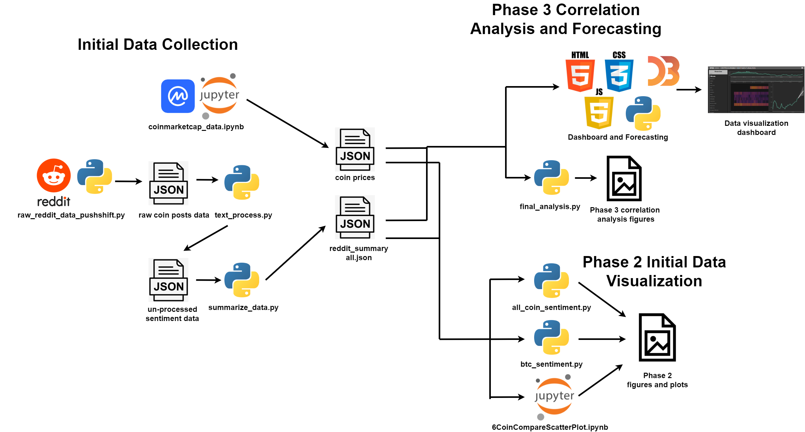

# SYSC 4906 Term Project
The goal of this project was to gather data from reddit and analyze the sentiment of posts in communities that have strong interests in investment, cryptocurrency, and world politics. All of which is done in order to determine if there exists a link between these sentiments and the flucuation of cryptocurrencies, and if a link exists if it can be used to accurately predicted future market behaviour as a consequence of social media based mass hysteria among these populations. The code we have compiled for the initial data munging phase, data analysis and dashboard can be found in the Github Repository linked below.  

### Step 1 Initial Data Munging and Analysis
The files found in src/data can be used for performing intial data analysis:
 
<b>src/data/config</b> contains a configuration file that can be used to define several functions:
 - where data from reddit is being pulled from (ie. what subreddit)
 - with what keywords should we focus on (if any keywords are included, otherwise we can use a set of default keywords, or pull all the data)
 - How many days in the past should we pull from
  

<b>src/data/raw_reddit_data.py</b> using the config file mentioned above, this script will pull data from reddit. To do this it uses a bot, in order to run this code properly a .env file needs to be configured. Please email me (aedynladd@cmail.carleton.ca) for the data necessary for the .env file. An alternative to this file which pulls data from reddit using the official reddit API is to use the file labelled as <b>src/data/raw_reddit_data_pushshift.py</b> which uses data from pushshift - an unofficial reddit repository created to store the data of posts without being restricted by the 1000 limit.

  
<b>src/data/text_process.py</b> this script will pull all the previously collected data into a single file, perform analysis on sentiment in posts, and organize by the days that posts occured

  
<b>src/data/summarize_data.py</b> this script creates a summary of all the afformentioned data grouped per day, displaying information such as the combined sentiment, number of posts, and sentiment as it relates to keywords.

  
<b>src/visualization/all_coin_sentiment.py</b> this script is from phase 2 and compares the overall coin sentiment on Reddit to the actual coin prices. More specifically it fetches and parses Reddit sentiment values for each day from <b>data/processed/reddit_summary.json</b> along with actual coin prices from json files in <b>/data/raw/coin market cap</b>. After the values have been fetched, they are plotted using matplotlib and all plots/figures are saved under <b>reports/figures</b>

  
<b>src/visualization/btc_sentiment.py</b> this script is from phase 2 and compares the Bitcoin sentiment on Reddit to the actual Bitcoin prices on CoinMarketCap. More specifically it fetches and parses Reddit Bitcoin sentiment values for each day for the 'BTC' and 'bitcoin' keywords from <b>data/processed/reddit_summary.json</b>. Additionally it also fetches and parses the actual Bitcoin prices from <b>/data/raw/coin market cap/Bitcoin.json</b>. After the values have been fetched, they are plotted using matplotlib and all plots/figures are saved under <b>reports/figures</b>.

### Step 2 Correlation Analysis

<b>src/models/final_analysis.py and X-correlation.py</b> these scripts are from phase 3 and perform all the correlation analysis in order to determine if the coin prices from CoinMarketCap in <b>/data/raw/coin market cap</b> and the reddit sentiment values from <b>data/processed/reddit_summary.json</b> are correlated. More specifically they read data from <b>data/processed/reddit_summary.json</b> along with coin prices from json files in <b>/data/raw/coin market cap</b>, donvert that data to stationary data and then perform a vareity of correlation quantification methods.

### Step 3 Forecasting with Vector Autoregression
 
<b>src/models/VectorAutoRegression</b>  This script is used to run a vector AutoRegression of the sentiment and coin open cost data. This script can be run in one of two modes: When the validate_or_predict flag is set to "validate" the model will run against data that it has previously collected on the coin cost against all 100 coins and store graphs and results in the folder identified as forecasts.  If run in "predict" mode, the model will predict the next 7 outcomes past the end of the time series.

### Step 4 Data visualization with Dashboard
 
<b>index.html<b>
<b>dashboard/data/compile.py</b>  To refresh dashboard variables with newly collected data, simply run the compile.py script, each step will return a 200 code if completeled succesfully, if all steps are completed succesfully then the dashboard will display new data on its refresh. The dashboard is also hosted online at the link below. It has only been tested for chrome, however d3 is the main engine used to power the dashboard and is cross compatible with multiple browsers.

## Reports and Other Items of Interest
### Project Proposal
https://www.overleaf.com/8239623562pxkkmdjdtbsg

### Progress Report
https://www.overleaf.com/1613467463dczmnhxynwsj

### Dashboard Link
https://aedynladd.github.io/sysc4906-termProject/

### Project Final Report
https://www.overleaf.com/3577894345mwxmjmxzjskx

### Final Presentation 
https://docs.google.com/presentation/d/16gKRliZqtwadpBltuRdMHWVnDxvsKGmFHstY9s-X3vM/edit?usp=sharing

